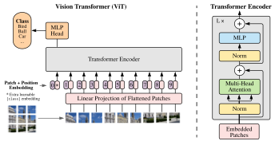
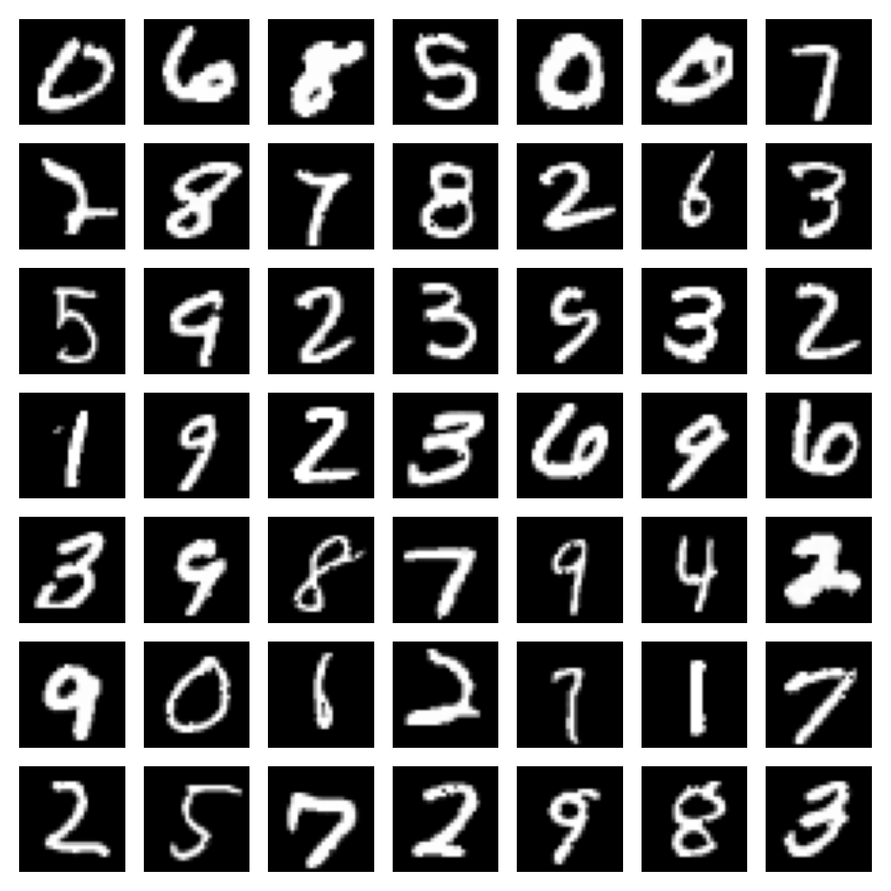

# Image Generation with Vision Transformers and Diffusion Models in Discrete State Spaces

[](https://github.com/paulffm/Image-Generation-with-Vision-Transformers-and-Diffusion-Models-in-Discrete-State-Spaces/blob/main/LICENSE)

This repository contains **PyTorch** implementations of the vision transformers from the paper [Scalable Diffusion Models with Transformers](https://openaccess.thecvf.com/content/ICCV2023/papers/Peebles_Scalable_Diffusion_Models_with_Transformers_ICCV_2023_paper.pdf) (DiT) by Peebles et al. and the paper [All are Worth Words: A ViT Backbone for Diffusion Models](https://arxiv.org/pdf/2209.12152) (UViT) by Bao et al., specifically designed for generating discrete data. More implementations of vision transformers for generating discrete data will be added soon.

**To my knowledge, there is currently no existing implementation or utilization of vision transformers in conjunction with diffusion models to generate discrete data within discrete state spaces. *(As of June 2024)***

<p align="center">
  
</p>

## Installation

You can simply install the DiT and UViT implementation as a Python package by using `pip`.

```shell script
pip install git+https://github.com/paulffm/Image-Generation-with-Vision-Transformers-and-Diffusion-Models-in-Discrete-State-Spaces
```

Alternatively, you can clone the repository as follows:

### 1. Clone the repository

Clone the repository using the following command:

```sh
git clone https://github.com/paulffm/Image-Generation-with-Vision-Transformers-and-Diffusion-Models-in-Discrete-State-Spaces.git
cd Image-Generation-with-Vision-Transformers-and-Diffusion-Models-in-Discrete-State-Spaces
```

### 2. Create a virtual environment

Create a virtual environment to install dependencies in isolation:

```sh
python -m venv myvenv
source myvenv/bin/activate  # On Windows use `myvenv\Scripts\activate`
```

### 3. Install dependencies

Install the necessary dependencies using pip:

```sh
pip install -r requirements.txt
```

## Usage

You can use the implementation of `DiT` or `UViT` as the backbone of every discrete diffusion model to generate images in pixel space. The output of these models are the logits over every pixel and has the output shape `B, C, H, W, S`, where `B` is the batch size, `C` the number of channels, `H` and `W` the height and the width of the image respectively and `S` the number of possible state values.

The constructor methods of the `DiT` or `UViT` class take the following parameters:

| Parameter | Description | Type |
| ------------- | ------------- | ------------- |
| img_size | Input resolution | Tuple[int, int] |
| in_channels | Number of input channels | int |
| patch_size | Depth of the stage (number of layers) | int |
| depth | Depth of the stage (number of layers) | int |
| hidden_dim | hidden dimension in the FFN | int |
| num_heads | Number of attention heads to be utilized | int |
| mlp_ratio | Ratio of the hidden dimension in the FFN to the input channels | float |
| dropout_attention | Dropout rate of attention map | float |
| num_classes | Number of classes | int |
| use_checkpoint | If true checkpointing is utilized | bool |

Additionally, this repository contains an [example training script](mnist_generation_example/train_mnist.py) specifically designed for image generation, particularly for generating [MNIST](http://yann.lecun.com/exdb/mnist/) data. In this example, the continuous-time discrete diffusion model, as described in the paper [A Continuous Time Framework for Discrete Denoising Models](https://arxiv.org/pdf/2205.14987), is utilized. Furthermore, there's a configuration file `mnist_generation_example/config/mnist_config` available to streamline the training and sampling process. The config file has the following parameters:

| Parameter | Description | Type |
| ------------- | ------------- | ------------- |
| device | Device to be used for training | str |
| distributed | Whether to use distributed training | bool |
| num_gpus | Number of GPUs to use | int |
| loss.name | Name of the loss function | str |
| loss.eps_ratio | Epsilon ratio for numerical stability | float |
| loss.nll_weight | Weight for negative log likelihood loss | int |
| loss.min_time | Minimum time value for loss computation | float |
| loss.one_forward_pass | Whether to use one forward pass for loss computation | bool |
| training.train_step_name | Name of the training step | str |
| training.n_iters | Number of training iterations | int |
| training.clip_grad | Whether to clip gradients | bool |
| training.grad_norm | Value for gradient norm clipping | int |
| training.warmup | Number of warmup iterations | int |
| training.max_t | Maximum time value for training | int |
| data.name | Name of the dataset | str |
| data.train | Whether to use training data | bool |
| data.download | Whether to download the dataset | bool |
| data.S | Number of possible state values | int |
| data.batch_size | Batch size for training | int |
| data.shuffle | Whether to shuffle the data | bool |
| data.image_size | Size of the input image | int |
| data.shape | Shape of the input data | list |
| data.use_augm | Whether to use data augmentation | bool |
| data.location | Location of the dataset | str |
| model.name | Name of the model | str |
| model.ema_decay | Exponential moving average decay rate | float |
| model.patch_size | Size of the patches | int |
| model.input_channel | Number of input channels | int |
| model.concat_dim | Concatenated dimension | int |
| model.hidden_dim | Hidden dimension in the FFN | int |
| model.depth | Depth of the model | int |
| model.num_heads | Number of attention heads | int |
| model.mlp_ratio | Ratio of FFN hidden dimension to input channels | float |
| model.dropout | Dropout rate for attention maps | float |
| model.time_scale_factor | Scale factor for time dimension | int |
| model.model_output | Output of the model | str |
| model.fix_logistic | Whether to fix logistic parameters | bool |
| model.data_min_max | Minimum and maximum values of the data | Tuple[int, int] |
| model.rate_sigma | Sigma value for the rate function | float |
| model.Q_sigma | Sigma value for Q function | float |
| model.time_exp | Exponential value for time dimension | float |
| model.time_base | Base value for time dimension | float |
| optimizer.name | Name of the optimizer | str |
| optimizer.lr | Learning rate for optimization | float |
| saving.checkpoint_freq | Frequency of saving checkpoints | int |
| saving.sample_plot_path | Path for saving sample plots | str |
| sampler.name | Name of the sampler | str |
| sampler.num_steps | Number of steps for sampling | int |
| sampler.min_t | Minimum value for time dimension | float |
| sampler.eps_ratio | Epsilon ratio for numerical stability | float |
| sampler.initial_dist | Initial distribution for sampling | str |
| sampler.num_corrector_steps | Number of corrector steps | int |
| sampler.corrector_step_size_multiplier | Multiplier for corrector step size | float |
| sampler.corrector_entry_time | Entry time for corrector steps | float |
| sampler.is_ordinal | Whether the data is ordinal | bool |
| sampler.sample_freq | Frequency of sampling | int |

## Results

Some generated MNIST samples with Tau-leaping and UViT as NN:

<p align="center">
  
</p>

## Reference

```bibtex
@inproceedings{peebles2023scalable,
  title={Scalable diffusion models with transformers},
  author={Peebles, William and Xie, Saining},
  booktitle={Proceedings of the IEEE/CVF International Conference on Computer Vision},
  pages={4195--4205},
  year={2023}
}
@inproceedings{bao2023all,
  title={All are worth words: A vit backbone for diffusion models},
  author={Bao, Fan and Nie, Shen and Xue, Kaiwen and Cao, Yue and Li, Chongxuan and Su, Hang and Zhu, Jun},
  booktitle={Proceedings of the IEEE/CVF Conference on Computer Vision and Pattern Recognition},
  pages={22669--22679},
  year={2023}
}
@article{campbell2022continuous,
  title={A continuous time framework for discrete denoising models},
  author={Campbell, Andrew and Benton, Joe and De Bortoli, Valentin and Rainforth, Thomas and Deligiannidis, George and Doucet, Arnaud},
  journal={Advances in Neural Information Processing Systems},
  volume={35},
  pages={28266--28279},
  year={2022}
}
```
